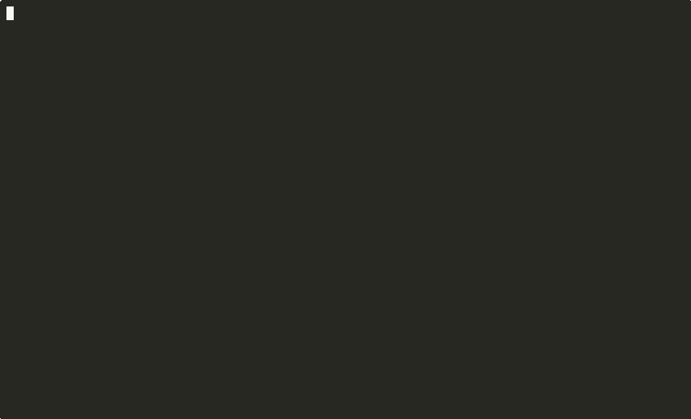

# CrawlDocs 🤖

[](https://golang.org)
[](https://opensource.org/licenses/MIT)
[](https://github.com/HelgeSverre/crawldocs/releases)

A Go-based website crawler that converts documentation websites into clean-ish markdown files for use as LLM
documentation, because humans are stupid and no longer needed.



## Features

- Concurrent crawling with rate limiting
- Stays within the target domain
- Converts HTML to clean markdown
- Two filename options: sequential numbering (0001.md) or URL-based slugs (installation.md)
- Configurable page limits and verbose output

## Installation

### Go Install

```bash
go install github.com/HelgeSverre/crawldocs@latest
```

### Build from Source

```bash
git clone https://github.com/HelgeSverre/crawldocs.git
cd crawldocs
make build
```

## Usage

```bash
# Basic usage
crawldocs -url=https://example.com/docs

# With options
crawldocs -url=https://laravel.com/docs -max=100 -slug -v
```

### Options

- `-url` - Target URL to crawl (required)
- `-o` - Output directory (defaults to domain name)
- `-max` - Maximum pages to crawl (default: 5000, 0 = unlimited)
- `-slug` - Use URL-based filenames instead of numbers
- `-v` - Verbose output

## Output

Files are saved as markdown with clean content:

```markdown
# Page Title

Source: https://example.com/page-url

---

Page content here...
```

Sequential naming: `0001.md`, `0002.md`, `0003.md`  
Slug naming (`-slug`): `installation.md`, `getting-started.md`

## How it Works

1. Crawls pages using [Colly](https://github.com/gocolly/colly)
2. Extracts text content from HTML
3. Removes CSS/JavaScript artifacts
4. Saves as numbered markdown files

## 🛠️ Development

### Prerequisites

- **Go 1.19+** - [Download](https://golang.org/dl/)
- **Make** - For build automation
- **Git** - For version control

### Build Commands

```bash
# Development build
make build

# Run tests with coverage
make test

# Clean build artifacts  
make clean

# Development server (auto-rebuild)
make dev
```

### Testing

```bash
# Run all tests
go test ./... -v

# Run tests with coverage
go test ./... -cover

# Benchmark tests
go test ./... -bench=.
```

## Limitations

- Does not execute JavaScript
- Does not download images or other assets
- Code blocks lose syntax highlighting

## License

This project is licensed under the MIT License - see the [LICENSE](LICENSE) file for details.

